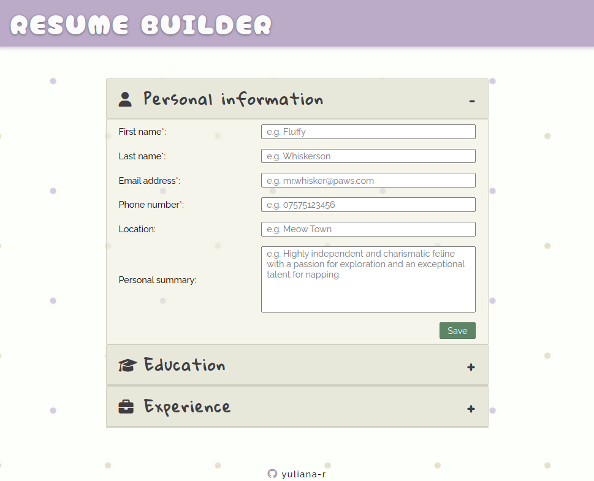
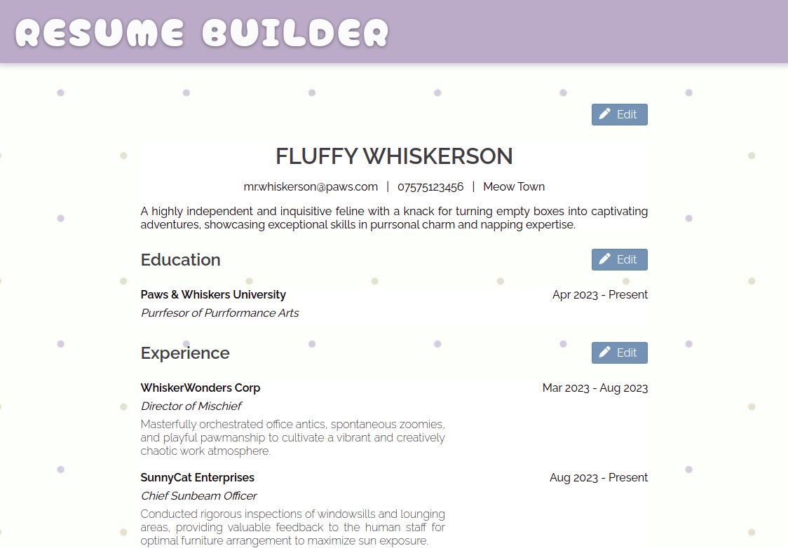

# CV Builder Application
## Introduction 

This project is a webpage of an editable resume application which uses the React library and is bundled using Vite.

The project primarily demonstrates use of basic structures in React, including elements, components, props, and state, in order to build a functional user interface.

## Preview

## Media & assets credits:

1. Flaticon (Dragon Icons): https://www.flaticon.com/free-icons/files-and-folders

2. Wallpaper Access: https://wallpaperaccess.com/minimalist-pattern 